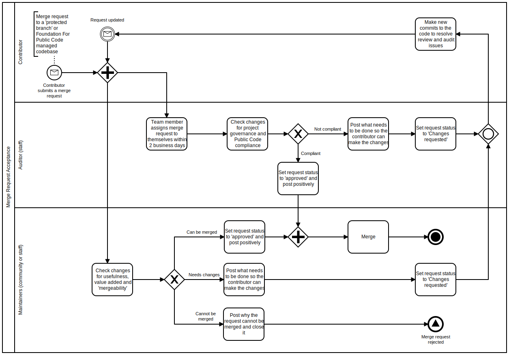

# Introduction

Public code is both civil code (like policy or regulation) and computer source code (such as software and algorithms) executed in a public context, by humans or machines.

The Foundation for Public Code makes the explicit distinction between regular software and public software because it operates under fundamentally different circumstances and expectations.

## What is public code

### Software code == legal code

Software is public infrastructure.

In the 21st century, software can be considered vital public infrastructure. It is increasingly not just the expression of existing policy but the originator of new policy - for example where algorithms decide which districts need extra social services or policing.

Software mechanics, algorithms and data collection have become key elements in the execution of public policies. Computer code now executes policies that have been codified in legal code through democratic procedures. Both forms of code set conditions for society to function according to democratically set public values, the latter executed by humans, the former by machines. In other words, software code has increasingly started to equal legal code. 

Software should therefore be subject to the principles of democratic governance.

### Traditional public software procurement

The current public software production method does not serve public service delivery very well.

In the last decade, public organisations that purchased complete software solutions have sometimes been surprised to discover that they:

* can’t change their software to reflect changing policy or take advantage of new technology
* don’t have own or even have access to their data
* are asked to pay ever increasing licence fees

### Technological sovereignty and democratic accountability

Public institutions, civil servants and residents deserve better.

We believe the software that runs our society can no longer be a black box, ordered from outside companies that keep the underlying logic on which their software operates hidden in proprietary code bases. Instead, governments need technological sovereignty - allowing them to set and control the functioning of public software, just like they are able to set and control policy that is legally formulated in laws. Citizens and civil society actors need this software to be transparent and accountable. The design of software as an essential civic infrastructure should honor digital citizens’ rights.

### Designing truly public software

Public code is at the core of modern public institutions, shapes the work of civil servants and affects the lives of almost all residents.

Public software must therefore be:

* transparent
* accountable
* understandable for its constituents

It must reflect the values of the society it serves, for example by being inclusive and non-discriminatory.

Most proprietary software systems currently used by public organisations do not meet these requirements. Public code - software built to operate with and as public infrastructure, along with the set of arrangements that allow for its production - does.

### Values of public code

We consider public code to have these core values:

* Inclusive
* Usable
* Open
* Legible
* Accountable
* Accessible
* Sustainable

## How public code works

Public code is open source software meant for fulfilling the critical role of public organizations. Through use, other administrations contribute back to the software, so that its development and maintenance become truly collaborative.

Being open unlocks many other things.

Local responsibility and democratic accountability are ensured when a public organisation implements and maintains their own public code. By being open and with a broader contributor base, the software is more secure - it benefits from many eyes spotting potential flaws. Many contributors share the maintenance work to keep it functional and modern, which reduces future technical debt. The shared workload is more sustainable now and in the future. Its openness makes the code and its data more easily adaptable in the future – it will be easier to retool, repurpose or retire. This all results in lower risk public infrastructure.

This pooling of resources lets public administrations give extra attention to how to customise the software so it works best in each local context - creating better user experiences for their end users (residents or citizens).

### Economics of public code

Public code offers a better economic model for public organisations as well as for commercial companies. It's an alternative to traditional software procurement, which increases local control and economic opportunity.

Designed from the start to be open, adaptable and with data portability, it can be developed by in-house staff or trusted vendors. Because the code is open, the public administration can change vendor if they need. Open code increases opportunities for public learning and scrutiny, allowing the public administration to procure smaller contracts - thereby making it easier for local small and medium enterprises to bid. Public administrations can use their own software purchasing to stimulate innovation and competition in their local economy.

This can be seen as investment leading to future economic growth - more vendors will be necessary due to growing technology demand.

### Procuring public code

Public code can be used by permanent in-house development teams, contractors or outsourced suppliers. Vendors to public organizations can include public code in their bids for contracts.

To use existing public code, you need to specify in your budget and project design that your new solution will use that codebase. To encourage an innovative approach to adapting the public code to your context, you could describe the service or outcome in your contract.

## Standard compliance or certification process

The Foundation for Public Code ensures that codebases under its stewardship (and not in incubation or the attic) are compliant with the Standard for Public Code. This makes clear to potential users and contributors that the codebase is of high quality, and updates will be too.

The audit performed the Foundation for Public Code is meant to complement machine testing, as machines are great at testing things like syntax and whether outcomes align with expectations. Things meant for humans, such as testing whether documentation is actually understandable and attached, the commit messages make sense and whether community guidelines are being followed are impossible for machines to test against.

The audit tests the entire codebase, including source code, policy, documentation and conversation for compliance with both the standards set out by the Foundation For Public Code and the standards set out in the codebase itself.

### How the process works

Every time a contribution is suggested to a codebase – through for instance a merge request – the [codebase stewards](https://about.publiccode.net/roles/) of the Foundation for Public Code will audit the contribution for compliance with the Standard for Public Code. New contributions can only be adopted into the codebase after they have been approved as compliant with the Standard for Public Code, as well as being reviewed by another contributor.

The audit is presented as a review of the contribution. The codebase steward gives line by line feedback and compliance, helping the contributor to improve their contribution. The merge request cannot be fulfilled until the codebase stewards have approved the contribution.

### Certifying an entire codebase versus a contribution

For the codebase to be completely certified every meaningful line of code, and the commits behind the code, need to meet the Standard.
 
If codebases have been completely audited from the first merge request they can be completely be certified as compliant with the Standard for Public Code immediately.

If the audit process is added to an existing codebase, the new merge requests can be certified, but the existing code cannot be certified. By auditing every new merge request the codebase can move towards being completely certified.

## The goals for the Standard for Public Code 

This Standard supports developers, designers, business management and policy makers to:

* develop high quality software and policy for better public service delivery
* develop reusable codebases that can be reused across contexts and collaboratively maintained
* reduce technical debt and project failure rate
* have more granular control over, and ability to make decisions about, their IT systems
* improve vendor relationships with a better economic model

The [Foundation for Public Code](https://publiccode.net/) helps public organisations share and adopt open source software, build sustainable developer communities and create a thriving ecosystem for public code. It does this through codebase stewardship. For this process the codebase stewards use the Standard for Public Code to make sure the code it stewards is high quality as well as collaboratively maintainable.

Potential users of codebases tested against the Standard for Public Code can expect them to be highly reusable, easily maintainable and high quality.

The Standard for Public Code does this by:

* setting out a common terminology for public code development
* establishing measures to help develop high quality public code
* providing guidance on how to fulfill its criteria and operationalise compliance

### Who this is for

The Standard for Public Code is for the people who create and reuse public code:

* policy makers
* business and project management
* developers and designers

These people work at:

* public organisations: institutions and administrations
* consultancies and vendors of information technology and policy services to public organisations

It is not aimed at public organisations' end users (residents or citizens), journalists or academics.
